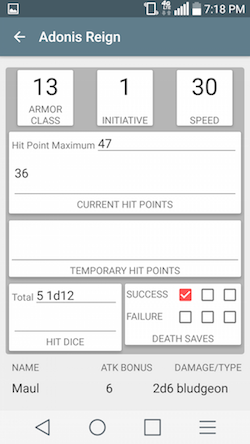

# CharacterSheet
## Requirements
* An android device running an SDK version of 21 or higher.

#### Optional Requirements
* NFC enabled on the android device for 'tap to share' character transfer.

## Images

## Installation
APK not currently available for download.  Installation will need to be achieved by cloning the repository.

## Usage
### Deleting a Character
1. From the main character menu long click the character you wish to delete.
2. Select delete from the action menu that appears.

### Exporting Characters
#### Tap to Share
1. Enable NFC on your device and the receiving device.
2. From the main character menu long click the character you wish to share.
3. Select share from the action menu that appears.
4. Hold NFC enabled devices together to share character.

### Deleting an Ally
1. Navigate to a character's ally page
2. Long click on the ally you wish to delete
3. Select delete from the action menu.
